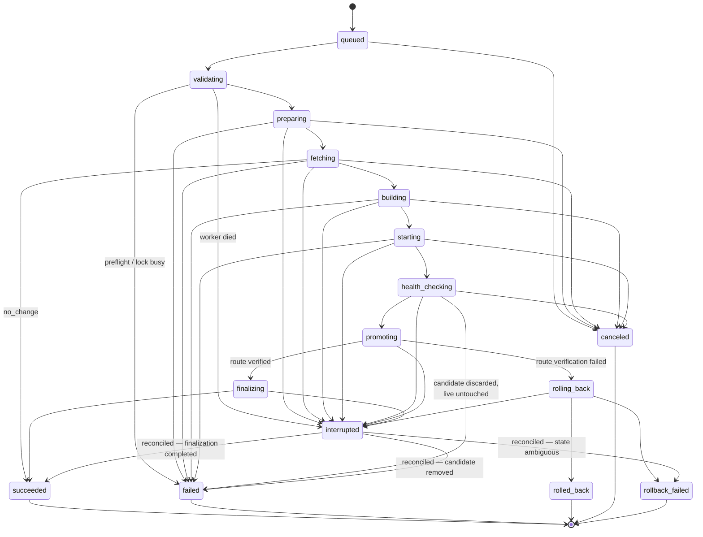

# The deployment engine

Architecture only — no implementation. The engine is the component that turns a
deployment request into a sequence of guarded, compensable operations against one
server.

It lives in `core/application/engine/`, which means it contains **no I/O**. It
shells out to nothing, opens no sockets, reads no clock directly. It receives
ports and calls them. That constraint is what allows the entire lifecycle —
including every failure and rollback path — to be tested deterministically with
in-memory fakes, and it is worth more than any other property of this design.

## Anatomy

| Component            | Responsibility                                                                                                                                                                                  |
| -------------------- | ----------------------------------------------------------------------------------------------------------------------------------------------------------------------------------------------- |
| **Step**             | One unit of work (build, start, promote). Declares timeout, retry eligibility, idempotency, and its compensating action. Knows nothing about the steps around it.                               |
| **Pipeline**         | The ordered list of steps for a deployment kind. Data, not control flow.                                                                                                                        |
| **Runner**           | Executes the pipeline: enforces timeouts, applies retry policy, records transitions, streams logs, checks cancellation, and on failure unwinds compensations in reverse order.                  |
| **Context**          | Carries the deployment record, resolved config, baseline, resolved sha, image reference, candidate handle, and the fencing token through the steps. Append-only within a run.                   |
| **Policies**         | The tunable decisions — health thresholds, retry counts and backoff, image retention, rollback eligibility — expressed as pure functions so they can be reasoned about and tested in isolation. |
| **Transition guard** | The single place that validates every state change against the state machine and rejects illegal ones.                                                                                          |

The runner is the only component that knows how to fail. Steps report what
happened; the runner decides what it means. A step containing its own `try/catch`
recovery is a design error — see
[decisions § D2](./decisions.md#d2--the-engine-is-a-declarative-step-pipeline-not-imperative-orchestration).

## Lifecycle

A deployment is a short-lived aggregate that moves through states exactly once.
No state is ever re-entered, which makes the history a clean audit trail.

### States

| State             | Kind        | Meaning                                                          | Lock held |
| ----------------- | ----------- | ---------------------------------------------------------------- | --------- |
| `queued`          | pending     | Admitted and persisted; no work started                          | no        |
| `validating`      | active      | Preflight checks running                                         | no        |
| `preparing`       | active      | Lock acquired; baseline being captured                           | yes       |
| `fetching`        | active      | Updating the workspace, resolving the ref to a sha               | yes       |
| `building`        | active      | Building the image                                               | yes       |
| `starting`        | active      | Candidate container starting; no traffic on it                   | yes       |
| `health_checking` | active      | Probing the candidate directly                                   | yes       |
| `promoting`       | active      | Proxy switch, container renames, route verification              | yes       |
| `finalizing`      | active      | Previous container stopped, release recorded, images pruned      | yes       |
| `rolling_back`    | active      | Returning to the baseline after a failed promotion               | yes       |
| `succeeded`       | terminal ✅ | Live and verified. Carries `outcome: deployed \| no_change`      | released  |
| `failed`          | terminal ❌ | Did not deploy. The previous release is still live and untouched | released  |
| `rolled_back`     | terminal ⚠️ | Promotion was reverted; the previous release is live again       | released  |
| `canceled`        | terminal ⚪ | Stopped on request at a step boundary; candidate discarded       | released  |
| `interrupted`     | active      | The worker died mid-run; awaiting the reconciler                 | expired   |
| `rollback_failed` | terminal ⛔ | Automatic recovery failed. **Requires a human.**                 | **held**  |

`interrupted` is not a terminal state — it is a marker meaning "the record and
the server may disagree, and reconciliation has not yet resolved which is right."

`rollback_failed` intentionally keeps the lock. Holding it prevents a further
automated deploy from stacking onto an unknown server state, and forces the
operator to act deliberately.

### State machine



### Invariants

Properties the transition guard enforces. Each is a candidate test.

1. **Single writer.** At most one deployment per project is in an active state.
2. **Lock before mutation.** No step that touches the server runs outside a held,
   unexpired, correctly fenced lock.
3. **Baseline before build.** `building` is unreachable unless a baseline was
   captured or the deployment is flagged `first_deploy`.
4. **Health before promotion.** `promoting` is reachable only from a passed
   `health_checking`. There is no forced or "skip health check" promotion.
5. **No going back.** No transition from a terminal state. No re-entering a state.
6. **Cancellation is bounded.** Cancellation is honored only at step boundaries,
   and never between the proxy switch and its verification.
7. **Lock always released.** Every terminal state except `rollback_failed`
   releases the lock, including on unexpected exceptions.
8. **Every failure is coded.** No deployment ends in `failed` without a stable
   error code and the step it failed in.

## Lock mechanism

The lock exists to make one guarantee: **one writer per project, even across
process crashes, and even against a human running Docker commands by hand.**

An in-process mutex cannot make that guarantee — it dies with the process while
the half-finished container it was protecting survives. So the lock is composed of
three layers, each covering a failure the others cannot.

| Layer                                    | Guards against                                             |
| ---------------------------------------- | ---------------------------------------------------------- |
| In-process mutex                         | Two concurrent requests in one instance — cheap fast path  |
| Persisted lease (unique row per project) | Process restart, two DeployHub instances, a stale worker   |
| Advisory `flock` on the target host      | Anything else operating on that server, including a person |

### Lease record

```
project_id     unique — one lock row per project, so contention is a constraint
                        violation rather than a race
deployment_id  who holds it
holder_id      which worker instance
epoch          monotonically increasing fencing token
acquired_at
heartbeat_at
expires_at     heartbeat_at + lease TTL
```

**Acquire** is a single conditional write: insert if absent, or take over if
`expires_at < now`. Taking over increments `epoch`. Because it is one atomic
statement, two workers racing produce exactly one winner with no distributed
consensus machinery.

**Heartbeat** renews `expires_at` at roughly a third of the TTL, so a transient
stall does not lose a valid lock.

**Fencing** is the part that is easy to omit and expensive to omit. A worker that
stalls past its TTL — GC pause, host suspend, blocked I/O — loses the lease
without knowing it; another worker takes over with `epoch + 1`; then the first
worker resumes and issues a `docker rm`. The lease alone does not stop it. So every
mutating call carries the epoch and is rejected if it is not current, and the
remote `flock` is held by the live process for the same purpose at the OS level.

**Release** is conditional on holding the current epoch. A stale holder's release
is a no-op instead of freeing someone else's lock.

**Expiry** is the backstop: if a worker dies without releasing, the lock frees
itself after the TTL, and the reconciler picks up the orphaned deployment.

### What the lock is not

It is not a queue — a rejected acquisition fails the deployment rather than
waiting. It is not a general-purpose distributed lock — it is a single-writer
lease scoped to one project. It does not protect reads; status and logs are
readable at all times.

## Failure handling

### Error taxonomy

Every failure is classified before it is acted on, because the class determines
the response.

| Class          | Examples                                                             | Retry                 | Terminal state           |
| -------------- | -------------------------------------------------------------------- | --------------------- | ------------------------ |
| `VALIDATION`   | Unknown project, malformed ref, invalid config                       | never                 | `failed` (pre-lock)      |
| `PRECONDITION` | Lock busy, disk below threshold, missing credential                  | never                 | `failed` (pre-lock)      |
| `TRANSIENT`    | SSH drop, DNS blip, git network error, registry 5xx                  | bounded + backoff     | `failed` if exhausted    |
| `USER_CODE`    | Build failed, container exited, health check failed                  | never — deterministic | `failed`                 |
| `INFRA`        | Docker daemon unreachable, out of disk mid-build, proxy reload error | once, then no         | `failed` / `rolled_back` |
| `TIMEOUT`      | Step or total budget exceeded                                        | never                 | `failed` / `rolled_back` |
| `CANCELED`     | Operator cancelled                                                   | n/a                   | `canceled`               |
| `INTERNAL`     | Illegal transition, invariant violated, bug                          | never                 | `failed`, alert          |

`USER_CODE` failures are never retried. A build that failed on a given sha will
fail again on that sha; retrying only wastes the lock and makes the log harder to
read. `TRANSIENT` failures are retried only for steps declared idempotent, which
is why the step table in
[`deployment-flow.md`](./deployment-flow.md#step-properties) records that flag.

### Handling sequence

When a step fails, the runner:

1. Classifies the error and attaches step, code, and a redacted message.
2. Retries with backoff if the class allows it and the step is idempotent and
   attempts remain.
3. Otherwise stops the pipeline and runs the compensations for completed steps in
   reverse order. Compensation is best-effort: each is attempted independently, and
   a failed compensation is recorded as a warning rather than aborting the unwind.
4. Chooses the terminal state from the decision point the failure occurred at
   (table in [`deployment-flow.md`](./deployment-flow.md#rollback-decision-points)).
5. Releases the lock — except in `rollback_failed`, where holding it is the point.
6. Persists, then emits the terminal event.

The asymmetry that matters: **before promotion, compensation is "remove what we
added"; after promotion, compensation is "put back what we replaced."** The first
cannot fail in a way that affects users. The second can, which is why the previous
container is deliberately kept running through promotion — the post-promotion
compensation is one proxy change against a process that is already up, not a cold
start under pressure.

### Degraded outcomes

Not every problem is a failure.

- A finalization step that fails (prune, log flush) yields `succeeded` with
  warnings attached. The release is live and verified; refusing to call that a
  success would be wrong.
- A no-op deploy yields `succeeded` with `outcome: no_change`.
- A rollback that succeeds yields `rolled_back` — deliberately not `failed`. The
  deployment did not ship, but the platform behaved correctly, and conflating the
  two hides how often promotion verification actually catches something.

## Recovery strategy

A power loss during `docker build` is not an edge case; it is the failure mode
this platform will actually meet. So recovery is a first-class component from day
one, not something bolted on after the first incident.

### The problem

If a worker dies mid-deployment, the record says `building` forever and the server
may hold a candidate container, a dangling image, a half-switched proxy, or
nothing at all. The record and reality disagree, and the record cannot be trusted
to say which.

### Reconciler

`server/runtime/reconciler.ts` runs at boot and on a periodic sweep:

1. **Find suspects**: deployments in an active state whose lock lease has expired,
   or whose `holder_id` is not a live worker. Mark them `interrupted`.
2. **Observe the server** — never infer from the record. List containers by
   DeployHub label, read the live proxy upstream, list images with their commit
   labels.
3. **Reconcile against the recorded phase**:

   | Observed reality                                                  | Action                                                                      | Result                          |
   | ----------------------------------------------------------------- | --------------------------------------------------------------------------- | ------------------------------- |
   | Died before promotion; candidate present or absent                | Remove the candidate and dangling image; baseline is still live and serving | `failed`                        |
   | Died mid-promotion; proxy still points at baseline                | Remove the candidate; treat as never promoted                               | `failed`                        |
   | Died mid-promotion; proxy points at candidate and it is healthy   | Complete the promotion (idempotent), then finalize                          | `succeeded`                     |
   | Died mid-promotion; proxy points at candidate and it is unhealthy | Roll back to baseline                                                       | `rolled_back`                   |
   | Died during finalization                                          | Re-run finalization — every finalization step is idempotent                 | `succeeded`                     |
   | Baseline container gone and candidate unhealthy — nothing serving | Attempt to start the baseline image by digest                               | `succeeded` / `rollback_failed` |
   | Cannot determine which container the route serves                 | Change nothing, alert                                                       | `rollback_failed`               |

4. **Release** the expired lease with a fresh epoch, so no zombie worker can act.
5. **Record** the reconciliation as an event on the deployment, so the timeline
   shows the interruption and its resolution rather than an unexplained state jump.

### What makes this possible

Recovery is only feasible because of choices made elsewhere in the design:

- **Labels on every container and image** — the server can be read back to
  deployment ids without a database.
- **The proxy upstream is observable** — the current routing target can be read,
  not guessed.
- **Idempotent steps** — a step can be re-run without knowing if it finished.
- **Image digests in the baseline** — the previous release is startable even if its
  container was destroyed.
- **The lease TTL** — a dead worker's lock frees itself.

Reconciliation is conservative by construction: when reality is ambiguous, it
changes nothing and escalates. An automated recovery that guesses wrong can turn a
stalled deployment into an outage, and a stalled deployment is the cheaper of the
two.

### Bounds

The reconciler restores consistency between the record and the server. It does not
resume a deployment from the middle — an interrupted deployment ends in a terminal
state, and shipping the intended change means triggering a new deployment. Resume
would require every step to be individually restartable, which is a large increase
in complexity for a rare event whose manual workaround is one click.
