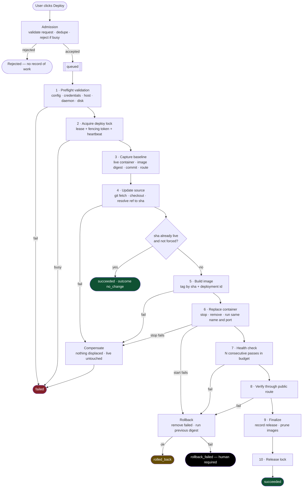

# Deployment flow

From **user clicks Deploy** to **deployment completed successfully**, and every
way it can end otherwise.

The flow has one governing invariant:

> **Nothing that is serving traffic is disturbed until a replacement has proven
> itself healthy.**

Everything before promotion is additive and disposable. Only promotion changes
what users see, and the previous container is kept alive across that switch so
the change can be undone in one operation. This is what makes most failures a
_discard_ (cheap, zero user impact) rather than a _rollback_.

## Overview

## Step by step

### Phase 0 — Admission (synchronous, in the request that handles the click)

Runs in the inbound request path. Fast, no side effects on the server being
deployed to.

1. **Authorize** the actor. (Auth is a later phase; the seam is here and never
   reaches `core/`.)
2. **Validate the request**: project exists and is enabled, target ref is
   syntactically valid, no unknown fields.
3. **Deduplicate**: the request carries an idempotency key derived client-side
   per click. A repeat key returns the _existing_ deployment instead of starting a
   second one. This is what makes a double-click harmless.
4. **Admit or reject on concurrency**: if the project already has a deployment in
   a non-terminal state, reject with `DEPLOYMENT_IN_PROGRESS`. Release 1 rejects
   rather than queues — see [decisions § D6](./decisions.md#d6--reject-concurrent-deploys-rather-than-queue-them).
5. **Persist** a `Deployment` record in state `queued`, capturing actor, target
   ref, trigger (`manual` | `rollback` | later `webhook`), and idempotency key.
6. **Return** the deployment id. The UI immediately subscribes to the status and
   log stream for that id.

A rejection at this phase leaves **no** deployment record — nothing happened.

### Phase 1 — Preflight validation (worker, before the lock)

Everything checkable without touching live state, so failures cost nothing and
hold no lock.

7. **Resolve effective config**: repository URL and credential reference, target
   branch/ref, Dockerfile path and build context, build args, runtime env
   reference, exposed container port, public route, health check spec (path,
   expected status, interval, required consecutive passes, total budget), image
   retention count.
8. **Validate the config as a whole** — a health path without a port, or a route
   with no upstream, is a configuration error, not a deploy failure.
9. **Check credentials resolve**: Git credential and SSH key exist in the secret
   provider. Presence only; values are never logged.
10. **Check the host**: SSH connects and returns from a trivial command; Docker
    daemon responds; free disk is above the configured threshold (a build that
    fills the disk can take the live container down with it).
11. On failure: state → `failed` with a `PREFLIGHT_*` code. No lock was taken, no
    remote state was modified.

### Phase 2 — Acquire the deployment lock

12. **Acquire** the per-project deploy lock: a persisted lease with a TTL, plus an
    advisory `flock` on the target server, returning a monotonically increasing
    **fencing token**. Both are required — the lease coordinates DeployHub with
    itself across restarts, the `flock` guards against a second DeployHub instance
    or a human running the same commands by hand.
13. **Start the heartbeat** that renews the lease. Every mutating command from here
    on validates the fencing token, so a paused-then-resumed worker whose lease
    expired cannot act on the server. Mechanism detail in
    [`deployment-engine.md` § Lock](./deployment-engine.md#lock-mechanism).

### Phase 3 — Capture the baseline (the rollback contract)

14. **Record what is live, before anything changes it**: the container running under
    the project's name, its id, image tag **and digest**, deployed commit sha, and
    the address it is published on. Read from the host, not from the record — there
    is one container per project, so the name identifies it unambiguously. Persist it
    on the deployment record.

    This is the rollback target, and under classic replacement it is the _only_ one:
    the container itself is removed in phase 6, so the digest is what the previous
    release can be rebuilt from. If it cannot be captured, the deployment does not
    proceed — a deploy with no known-good state to return to is not acceptable.

15. If there is no live container, mark the deployment `first_deploy`. Its
    compensation is "remove what was started"; there is no previous release to return
    to, and that is recorded explicitly rather than discovered during a failure.

### Phase 4 — Update source

16. **Ensure the workspace exists** at `/var/lib/deployhub/projects/<projectId>/repo`,
    cloning on first use.
17. **Fetch and check out**: `git fetch --prune`, then a hard checkout of the target
    ref into a clean tree. A dirty workspace is reset, never merged.
18. **Resolve the ref to an immutable commit sha** and record it. Every downstream
    step refers to the sha, never the branch name — a branch that moves mid-deploy
    must not change what gets built. See
    [decisions § D4](./decisions.md#d4--deployments-are-identified-by-immutable-commit-sha-and-image-digest).
19. **No-op short circuit**: if the resolved sha equals the live commit and the
    request is not `force`, finish as `succeeded` with `outcome: no_change`. No
    build, no restart, no user-visible event.

### Phase 5 — Build

20. **Build the image** tagged `deployhub/<project>:<sha>` with an additional
    `:deploy-<deploymentId>` tag, and OCI labels for commit, deployment id, actor,
    and build time. The labels are what makes an orphaned container on the server
    traceable back to a deployment record.
21. **Stream** build stdout/stderr to the log sink, line-tagged with the step, with
    secrets redacted.
22. Enforce the **build timeout**. On failure or timeout, the live container has not
    been touched: delete the dangling image and fail. → **decision point A**.

### Phase 6 — Replace the container

**The step that changes what users see** ([D12](decisions.md#d12--classic-replacement-stop-remove-run)).
Everything before it is reversible at no cost; nothing after it is.

23. **Stop the previous container**, allowing the grace period for a clean shutdown.
    On failure: nothing has been displaced — it is still running and still serving —
    so this is an ordinary failure. → **decision point B**.
24. **Remove it**, freeing the name and the published port. **From here the project
    has nothing serving**, and every subsequent failure is an outage rather than a
    non-event. On failure: roll back.
25. **Run the new container** under the project's name, publishing the same fixed
    host port, with runtime env injected from the secret provider. The host's proxy
    is unchanged and unaware — the port it points at has not moved.
26. **Confirm it reached `running`** and did not immediately exit or enter a restart
    loop. On failure: capture its logs onto the deployment record and roll back.
    → **decision point C**.

### Phase 7 — Health check

27. **Probe** the new container on its published port until it returns the expected
    status on the health path for **N consecutive attempts** inside the total budget.
    Between probes, re-assert the container is still running — a container that exits
    mid-probe fails immediately rather than waiting out the budget.
28. On failure: **capture its container logs onto the deployment record** (the single
    most useful artifact for diagnosing a bad release) and roll back with
    `HEALTH_CHECK_FAILED`.

    This is a **rollback**, not a discard. The container being probed is already
    serving traffic, so a failure here is an outage in progress. Under the superseded
    candidate design this was the cheap case; it is now the expensive one, and the
    naming reflects that because the two have different blast radii.

### Phase 8 — Verify through the public route

29. **Health check again, through the public route** rather than the published port.
    A distinct check with a distinct purpose: step 27 proved the application works,
    step 29 proves it is reachable the way a user reaches it — through the host's
    proxy and its TLS. A correct container behind a broken proxy config is a real and
    otherwise invisible failure, and this is the only thing that catches it.
30. On failure: **rollback**. → **decision point D**.

### Rollback

31. **Remove the failed container**, freeing the name and port. Then **run the
    baseline image by digest** under the same name, and end in `rolled_back`. The
    digest, not the tag: the build that just failed may have reassigned the tag.
32. If the rollback itself fails, end in `rollback_failed`: keep the lock held,
    persist everything known about both containers, and raise the loudest
    notification available. This state exists to be impossible to ignore — it is
    the only outcome that leaves the platform requiring a human.

### Phase 9 — Finalize

Past this point the deployment has succeeded; nothing here can un-succeed it.
Failures are recorded as warnings, not converted into rollbacks.

The previous container is **not** stopped here — phase 6 already stopped and removed
it, because its name and port were needed. What makes a manual rollback near-instant
is its image, which retention protects.

33. **Persist the release**: commit sha, image digest, container id, actor,
    per-step durations, total duration.
34. **Prune** images beyond the retention count, oldest first, never touching the
    live one or the immediate previous one.
35. **Flush** the log stream and mark the log artifact complete.

### Phase 10 — Release

36. **Release the lock** using the fencing token and stop the heartbeat. Releasing
    is unconditional — it runs on every terminal path except `rollback_failed`.
37. **State → `succeeded`**, emit `deployment.succeeded`.

## Step properties

The engine treats a step as data, not as a block of imperative code. Each step
declares these properties, and the engine — not the step — decides what to do
when one fails. See
[`deployment-engine.md` § Failure handling](./deployment-engine.md#failure-handling).

| #   | Step             | Mutates live? | Idempotent                | Retryable | Compensation                        |
| --- | ---------------- | ------------- | ------------------------- | --------- | ----------------------------------- |
| 1   | Preflight        | no            | yes                       | yes       | none needed                         |
| 2   | Acquire lock     | no            | yes (same holder)         | no        | release lock                        |
| 3   | Capture baseline | no            | yes                       | yes       | none needed                         |
| 4   | Update source    | no            | yes                       | yes       | none needed (workspace is derived)  |
| 5   | Build            | no            | yes (same sha → same tag) | yes       | delete built/dangling image         |
| 6   | Start candidate  | no            | no (creates)              | no        | remove candidate container          |
| 7   | Health check     | no            | yes (read-only)           | built in  | remove candidate container          |
| 8   | Promote          | **yes**       | yes (converges)           | no        | repoint proxy to baseline           |
| 9   | Verify route     | no            | yes (read-only)           | built in  | repoint proxy to baseline           |
| 10  | Finalize         | no            | yes                       | yes       | none — warn only                    |
| 11  | Release lock     | no            | yes                       | yes       | none — lease expiry is the backstop |

"Idempotent" is what makes crash recovery possible: the reconciler can re-run an
idempotent step without knowing whether the crashed attempt completed it.

## Rollback decision points

| Point | Failure                            | Live traffic during failure | Action                                      | End state         |
| ----- | ---------------------------------- | --------------------------- | ------------------------------------------- | ----------------- |
| —     | Admission / preflight              | unaffected                  | none — nothing was started                  | `failed`          |
| A     | Build failed or timed out          | unaffected                  | discard image                               | `failed`          |
| B     | Candidate would not start          | unaffected                  | capture logs, remove candidate              | `failed`          |
| C     | Candidate failed health check      | unaffected                  | capture logs, remove candidate              | `failed`          |
| D     | Post-promotion verification failed | briefly affected            | **rollback** — repoint proxy, restore names | `rolled_back`     |
| D′    | Rollback itself failed             | affected                    | hold lock, alert, stop automation           | `rollback_failed` |
| E     | Finalization step failed           | unaffected                  | record warning, continue                    | `succeeded`       |

Automatic rollback exists at exactly one point. Everywhere before promotion the
correct action is to discard the candidate, and calling that a "rollback" would
overstate what happened and dilute the signal from a real one.

**Manual rollback is not a special code path.** "Roll back to release _R_" creates
a new deployment with `trigger: rollback` and `targetSha: R.commitSha`, which runs
this same pipeline. If `R`'s image digest is still present on the host, the build
step is a cache hit and the rollback is fast; if it was pruned, it rebuilds. One
pipeline, one set of states, one set of tests — see
[decisions § D5](./decisions.md#d5--rollback-is-a-deployment-not-a-separate-mechanism).

## Cross-cutting behavior

These apply at every step rather than at any one of them, which is why they live
in the engine and not in the steps.

**Logging.** Every step opens a logical block and streams to an append-only sink,
each line carrying deployment id, step, timestamp, and stream (`stdout` |
`stderr` | `system`). Logs are diagnostic artifacts, never the source of truth for
status — the deployment record is. Secrets are redacted at the sink boundary, so
no adapter can leak one by forgetting to.

**Status updates.** Every transition writes the deployment record, then publishes
an event. The database is authoritative; events are a notification that it
changed. A dropped event costs a UI refresh, never correctness.

**Timeouts.** Every step has its own timeout, and the deployment has a total
budget. A step that exceeds its timeout is cancelled and treated as a failure at
its own decision point — a hung build must not hold the lock indefinitely.

**Cancellation.** Cancellation is requested by flag and honored at step
boundaries, never mid-command. A cancel during promotion is deferred until
promotion completes, then handled as a rollback. Killing a `docker build`
half-way is safe; killing a proxy reload half-way is not.

**Error taxonomy.** Every failure carries a stable machine-readable code plus a
human-readable summary, so the UI can explain a failure without parsing log text.
